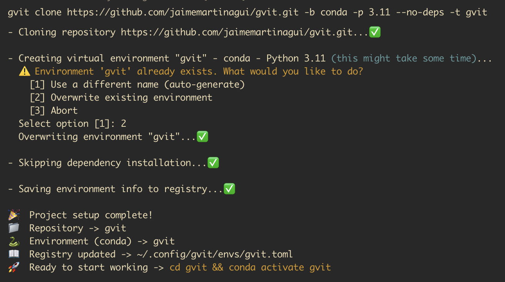
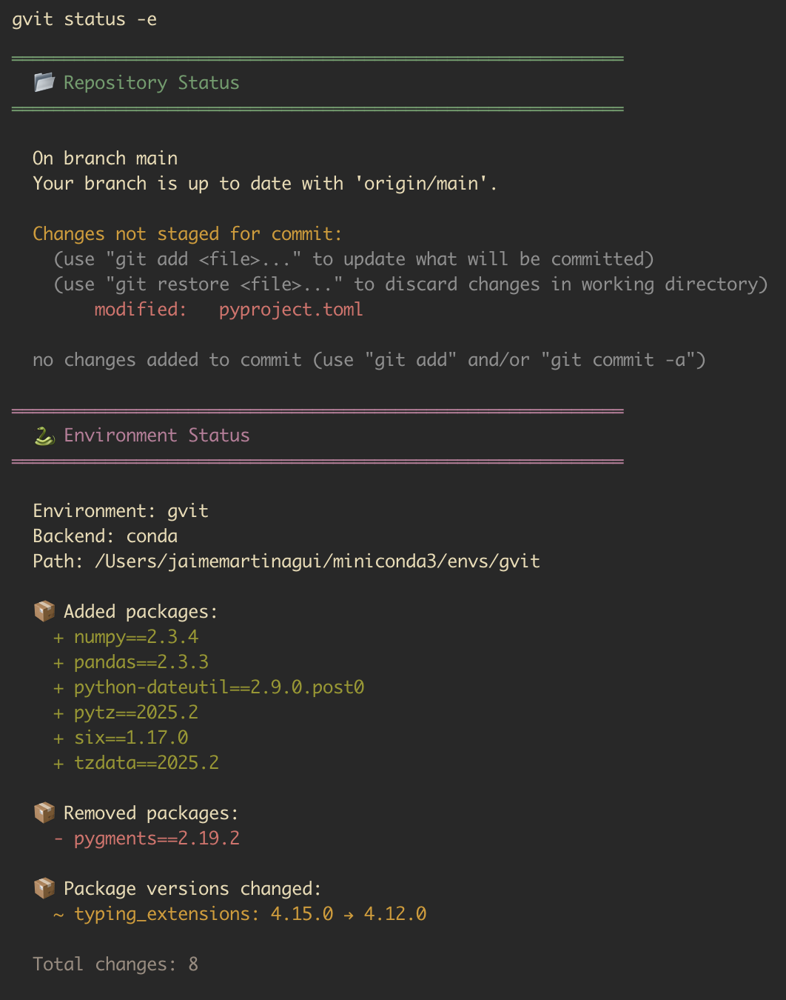
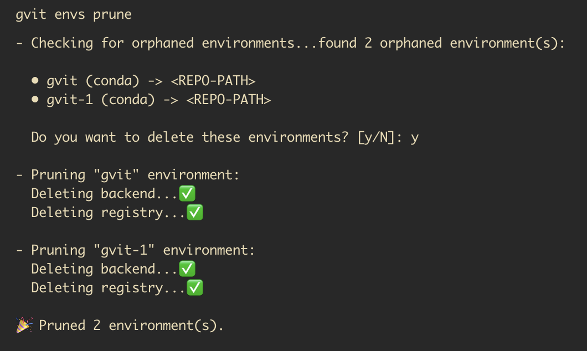

```
                      ░██   ░██    
                            ░██    
 ░████████ ░██    ░██ ░██░████████ 
░██    ░██ ░██    ░██ ░██   ░██    
░██    ░██  ░██  ░██  ░██   ░██    
░██   ░███   ░██░██   ░██   ░██    
 ░█████░██    ░███    ░██    ░████ 
       ░██                         
 ░███████                          


Git-aware Virtual Environment Manager
```

**Automates virtual environment management for Git repositories.**

---

## ⭐ Vision

> *“One repo, its own environment — without thinking about it.”*

The goal of **`gvit`** CLI is to eliminate the need to manually create or update virtual environments. No more friction between version control and Python environment management. Git and Python should work together seamlessly — this tool makes it possible.

---

## 🚀 Motivation

Have you ever cloned a project and had to do all this?

```bash
git clone https://github.com/someone/project.git
cd project
python -m venv .venv
source .venv/bin/activate
pip install -r requirements.txt
```

With **`gvit`**, all of that happens automatically:

```bash
# Clone from scratch
gvit clone https://github.com/someone/project.git

# Or setup an existing repo
cd existing-project
gvit setup
```

🎉 Environment created and dependencies installed!

### When to use gvit vs other tools

**Use `gvit` if you:**
- Work on multiple projects simultaneously.
- Want Git workflows to automatically sync environments.
- Need centralized environment tracking.
- Want flexibility in backends (e.g. `conda` is crucial for certain DS/ML projects).
- Work with legacy projects that still do not use `pyproject.toml`.

**Use `uv` if you:**
- Primarily work on one project at a time.
- Want the fastest package installation.
- Focus on modern Python packaging (`pyproject.toml`).
- Need advanced dependency resolution.

---

## ⚙️ What `gvit` does

* 🪄 **Automatically creates environments** when cloning or initializing repos.
* 📦 **Installs dependencies** from `requirements.txt`, `pyproject.toml`, or custom paths.
* 🎯 **Supports extra dependencies** (dev, test, etc.) from `pyproject.toml` or separate files.
* 🔄 **Git command fallback**: Use `gvit` for all git commands - unknown commands automatically fallback to git.
* 🧠 **Remembers your preferences** via local configuration (`~/.config/gvit/config.toml`).
* 📝 **Tracks environments** in registry (`~/.config/gvit/envs/`) with metadata and dependency hashes.
* 🧘 **Cleans orphaned environments** automatically with `prune` command.
* 🌳 **Visual command tree** to explore available commands.
* 🔧 **Flexible configuration**: per-repository (`.gvit.toml`) or global settings.
* 🐍 **Multiple backends**: `venv` (built-in), `conda`, and `virtualenv` support.
* 🔒 **Dependency validation**: `commit` command validates installed packages match declared dependencies.
* 📄 **Status overview**: `status` command shows both Git and environment changes in one view.

---

## 💻 Installation

```bash
pip install gvit
```

Or with `pipx` (recommended for CLI tools):

```bash
pipx install gvit
```

---

## 🧩 Usage

### Initial Configuration

Set up your default preferences (interactive):

```bash
gvit config setup
```

Or specify options directly:

```bash
gvit config setup --backend venv --python 3.11 --base-deps requirements.txt

# or use conda
gvit config setup --backend conda --python 3.12

# or use virtualenv (faster, more features)
gvit config setup --backend virtualenv --python 3.11
```

### Clone a Repository

Basic clone with automatic environment creation:

```bash
gvit clone https://github.com/user/repo.git
```



**Advanced options:**

```bash
# Custom environment name
gvit clone https://github.com/user/repo.git --venv-name my-env

# Specify Python version
gvit clone https://github.com/user/repo.git --python 3.12

# Install extra dependencies from pyproject.toml
gvit clone https://github.com/user/repo.git --extra-deps dev,test

# Skip dependency installation
gvit clone https://github.com/user/repo.git --no-deps

# Force overwrite existing environment
gvit clone https://github.com/user/repo.git --force

# Verbose output
gvit clone https://github.com/user/repo.git --verbose
```

### Initialize a New Project

Similar to `git init` but with environment setup:

```bash
# In current directory
gvit init

# In specific directory (--target-dir)
gvit init -t my-project

# With remote repository
gvit init --remote-url https://github.com/user/my-project.git

# With all options
gvit init -t my-project \
  --remote-url https://github.com/user/my-project.git \
  --python 3.12 \
  --extra-deps dev,test
```

### Setup an Existing Repository

If you already have a cloned repository and want to set up the environment:

```bash
# In the repository directory
cd my-existing-repo
gvit setup

# Or specify a different directory (--target-dir)
gvit setup -t path/to/repo

# With custom options
gvit setup --python 3.12 --extra-deps dev,test

# Skip dependency installation
gvit setup --no-deps
```

### Pull Changes and Update Dependencies

Smart `git pull` that automatically detects and reinstalls changed dependencies:

```bash
# Pull and auto-update dependencies if changed
gvit pull

# Pull without checking dependencies
gvit pull --no-deps

# Force reinstall all dependencies even if unchanged
gvit pull --force-deps

# Pass options to git pull
gvit pull --rebase origin main
```

### Commit with Dependency Validation

Smart `git commit` that validates your installed packages match your dependency files:

```bash
# Commit with automatic validation
gvit commit -m "Add new feature"

# Skip validation if needed
gvit commit --skip-validation -m "Quick fix"

# Pass any git commit options
gvit commit -a -m "Update everything"
gvit commit --amend
```

**What it validates:**
- ✅ Detects added packages not declared in dependency files
- ✅ Detects removed packages still declared in dependency files  
- ✅ Detects version changes not reflected in pinned versions
- ✅ Works with `requirements.txt`, `pyproject.toml`, and custom paths
- ✅ Shows detailed diff of package changes (added/removed/modified)

### Check Status

Combined view of Git status and environment changes:

```
# Show just repository (same as `git status`)
gvit status

# Show repository and environment status
gvit status -e

# In a specific directory
gvit status -e --target-dir path/to/repo
```

**What it shows:**
- 📂 **Repository Status**: Standard `git status` output
- 🐍 **Environment Status**: Packages added/removed/modified since last tracking
- ✅ Clean overview of both code and dependency changes
- ⚡ Quick way to see if you need to update dependency files



### Configuration Management

```bash
# Add extra dependency groups to local config
gvit config add-extra-deps dev requirements-dev.txt
gvit config add-extra-deps test requirements-test.txt

# Remove extra dependency groups
gvit config remove-extra-deps dev

# Show current configuration
gvit config show
```

### Environment Management

```bash
# List all tracked environments
gvit envs list

# Show details of a specific environment
gvit envs show my-env

# Remove an environment (registry and backend)
gvit envs delete my-env

# Reset an environment (recreate and reinstall dependencies)
gvit envs reset my-env

# Reset without reinstalling dependencies
gvit envs reset my-env --no-deps

# Clean up orphaned environments (repos that no longer exist)
gvit envs prune

# Preview what would be removed
gvit envs prune --dry-run

# Auto-confirm removal
gvit envs prune --yes
```



### Use Git Commands Directly

`gvit` can replace `git` in your daily workflow! Any command not implemented in gvit automatically falls back to git:

```bash
# These work exactly like git commands
gvit add file.py
gvit diff --stat
gvit log --oneline -10
gvit branch -a
gvit checkout -b feature
gvit push origin main
gvit stash
gvit rebase main

# Complete workflow with gvit
gvit status              # gvit's enhanced status
gvit add .
gvit commit -m "feat"    # gvit's validated commit
gvit push
```

**How it works:**
- 🔍 gvit checks if the command is implemented (clone, commit, init, pull, status, etc.)
- ✅ If implemented: runs gvit's enhanced version
- 🔄 If not implemented: automatically forwards to `git`
- 🎯 Seamless experience - just replace `git` with `gvit`

**Git aliases support:**

`gvit` automatically resolves your git aliases and uses gvit's enhanced versions when available!

```bash
# If you have git aliases configured:
# git config --global alias.st status
# git config --global alias.ci commit
# git config --global alias.co checkout

# These will use gvit's enhanced versions
gvit st      # → gvit status (with environment tracking)
gvit ci -m   # → gvit commit (with validation)

# This will use git directly
gvit co main # → git checkout main
```

- 🔗 Respects all your existing git aliases
- 🚀 Automatically uses gvit's enhanced versions when the alias resolves to a gvit command
- 🔄 Falls back to git for non-gvit commands

### Explore Commands

```bash
# Show all available commands in tree structure
gvit tree
```

---

## 🧠 How it works

### Commands

**`gvit clone`**: Clones repository + creates environment
1. **Clones the repository** using standard `git clone`
2. **Detects repository name** from URL (handles `.git` suffix correctly)
3. Proceeds to environment setup (steps 3-7 below)

**`gvit init`**: Initializes Git repository + creates environment
1. **Initializes Git repository** using `git init`
2. **Optionally adds remote** if `--remote-url` is provided
3. Proceeds to environment setup (steps 3-7 below)

**`gvit setup`**: Creates environment for existing repository
1. **Verifies Git repository** exists in target directory
2. **Detects remote URL** if available
3. Proceeds to environment setup (steps 3-7 below)

**`gvit pull`**: Pulls changes and syncs dependencies
1. **Finds tracked environment** for current repository
2. **Runs `git pull`** with any extra arguments you provide
3. **Compares dependency file hashes** (stored in registry vs. current files)
4. **Reinstalls only changed dependencies** automatically
5. **Updates registry** with new hashes

**`gvit envs reset`**: Resets an environment to clean state
1. **Deletes the environment backend** (venv folder or conda env)
2. **Recreates it empty** with the same Python version
3. **Reinstalls dependencies** from registry (unless `--no-deps`)
4. **Updates registry** with new hashes, freeze snapshot, and timestamp
5. **Preserves registry entry** (unlike `delete` + `setup`)

**`gvit commit`**: Validates dependencies before committing
1. **Finds tracked environment** for current repository
2. **Compares pip freeze outputs** (stored snapshot vs. current state)
3. **Detects package changes**: added, removed, modified versions
4. **Validates dependency files** to ensure changes are reflected
5. **Shows detailed report** of discrepancies (if any)
6. **Runs `git commit`** with any extra arguments you provide

**`gvit status`**: Shows combined repository and environment status
1. **Displays `git status` output** for repository changes
2. **Finds tracked environment** for current repository
3. **Compares pip freeze outputs** (stored snapshot vs. current state)
4. **Shows package changes**: added, removed, modified versions
5. **Provides clean overview** of both code and dependency changes

### Environment Setup Process (common to all commands)

3. **Creates virtual environment** using your preferred backend:
   - **`venv`**: Python's built-in venv module (creates `.venv/` in repo)
   - **`virtualenv`**: Enhanced virtual environments (creates `.venv/` in repo, faster than venv)
   - **`conda`**: Conda environments (centralized management)
4. **Resolves dependencies** with priority system:
   - CLI arguments (highest priority)
   - Repository config (`.gvit.toml`)
   - Local config (`~/.config/gvit/config.toml`)
   - Default values (lowest priority)
5. **Installs dependencies** from:
   - `pyproject.toml` (with optional extras support)
   - `requirements.txt` or custom paths
   - Multiple dependency groups (_base, dev, test, etc.)
6. **Tracks environment in registry**:
   - Saves environment metadata to `~/.config/gvit/envs/{env_name}.toml`
   - Records dependency file hashes for change detection
   - Stores complete pip freeze snapshot for validation
   - Stores repository information (path, URL)
7. **Validates and handles conflicts**: 
   - Detects existing environments
   - Offers options: rename, overwrite, or abort
   - Auto-generates unique names if needed

---

## ⚙️ Configuration

### Local Configuration

Global preferences: `~/.config/gvit/config.toml`

```toml
[gvit]
backend = "venv"  # or "conda", "virtualenv"
python = "3.11"

[deps]
_base = "requirements.txt"
dev = "requirements-dev.txt"
test = "requirements-test.txt"

[backends.venv]
name = ".venv"  # Directory name for venv (default: .venv)

[backends.virtualenv]
name = ".venv"  # Directory name for virtualenv (default: .venv)

[backends.conda]
path = "/path/to/conda"  # Optional: custom conda path
```

### Environment Registry

Environment tracking: `~/.config/gvit/envs/{env_name}.toml`

```toml
[environment]
name = "my-project"
backend = "conda"
python = "3.11"
created_at = "2025-01-22T20:53:01.123456"

[repository]
path = "/Users/user/projects/my-project"
url = "https://github.com/user/my-project.git"

[deps]
_base = "requirements.txt"
dev = "requirements-dev.txt"

[deps.installed]
_base_hash = "a1b2c3d4e5f6g7h8"  # SHA256 hash for change detection
dev_hash = "i9j0k1l2m3n4o5p6"
_freeze_hash = "q7r8s9t0u1v2w3x4"  # SHA256 hash of pip freeze output
_freeze = """  # Complete pip freeze snapshot for validation
package1==1.0.0
package2==2.3.4
"""
installed_at = "2025-01-22T20:53:15.789012"
```

### Repository Configuration

Per-project settings: `.gvit.toml` (in repository root)

```toml
[gvit]
python = "3.12"  # Override Python version for this project

[deps]
_base = "requirements.txt"
dev = "requirements-dev.txt"
internal = "requirements-internal.txt"
```

Or use `pyproject.toml` (tool section):

```toml
[tool.gvit]
python = "3.12"

[tool.gvit.deps]
_base = "pyproject.toml"
```

---

## 🧱 Architecture

```
gvit/
├── src/gvit/
│   ├── cli.py              # CLI entry point (Typer app)
│   ├── env_registry.py     # Environment registry management
│   ├── commands/
│   │   ├── _common.py      # Shared functions between commands
│   │   ├── clone.py        # Clone command logic
│   │   ├── init.py         # Init command logic
│   │   ├── setup.py        # Setup command logic (existing repos)
│   │   ├── pull.py         # Pull command with smart dependency sync
│   │   ├── commit.py       # Commit command with dependency validation
│   │   ├── status.py       # Status command (git + environment overview)
│   │   ├── tree.py         # Tree command (show command structure)
│   │   ├── config.py       # Config management commands
│   │   └── envs.py         # Environment management commands
│   ├── backends/
│   │   ├── venv.py         # Venv backend implementation
│   │   ├── virtualenv.py   # Virtualenv backend implementation
│   │   └── conda.py        # Conda backend implementation
│   ├── utils/
│   │   ├── exceptions.py   # Custom exceptions
│   │   ├── utils.py        # Helper functions
│   │   ├── validators.py   # Input validation
│   │   ├── globals.py      # Constants and defaults
│   │   └── schemas.py      # Type definitions (TypedDict)
│   └── __init__.py
└── pyproject.toml          # Project metadata
```

---

## 🧭 Roadmap

### Current Release (v0.0.3)

| Feature | Status | Description |
|---------|--------|-------------|
| **Clone command** | ✅ | Full repository cloning with environment setup |
| **Init command** | ✅ | Initialize new Git repos with environment setup |
| **Setup command** | ✅ | Create environment for existing repositories |
| **Pull command** | ✅ | Smart git pull with automatic dependency sync |
| **Commit command** | ✅ | Git commit with automatic dependency validation |
| **Tree command** | ✅ | Visual command structure explorer |
| **Venv backend** | ✅ | Python's built-in venv support |
| **Conda backend** | ✅ | Complete conda integration |
| **Virtualenv backend** | ✅ | Complete virtualenv integration |
| **Config management** | ✅ | `setup`, `add-extra-deps`, `remove-extra-deps`, `show` |
| **Environment registry** | ✅ | Track environments with metadata, dependency hashes, and freeze snapshots |
| **Environment management** | ✅ | `list`, `show`, `delete`, `prune`, `reset` commands |
| **Orphan cleanup** | ✅ | Automatic detection and removal of orphaned environments |
| **Dependency resolution** | ✅ | Priority-based resolution (CLI > repo > local > default) |
| **pyproject.toml support** | ✅ | Install base + optional dependencies (extras) |
| **Requirements.txt support** | ✅ | Standard pip requirements files |
| **Custom dependency paths** | ✅ | Flexible path specification via config or CLI |
| **Environment validation** | ✅ | Detect conflicts, offer resolution options |
| **TypedDict schemas** | ✅ | Full type safety with typed configuration schemas |
| **Dependency validation** | ✅ | Validate installed packages match declared dependencies on commit |
| **Status command** | ✅ | Combined view of Git status and environment changes |
| **Git command fallback** | ✅ | Automatic fallback to git for unknown commands |

### Next Releases

| Version | Status | Description |
|---------|--------|-------------|
| **0.6.0** | 📋 Planned | Add `checkout` command to switch branches and sync deps |
| **0.6.0** | 📋 Planned | Shell integration (`gvit activate`) and completions |
| **0.6.0** | 📋 Planned | `gvit sync` command for full dependency refresh |
| **1.0.0** | 🎯 Goal | Stable release with all core features |

---

## 🧑‍💻 Example Workflows

### First Time Setup

```bash
# Install gvit
pipx install gvit

# Configure defaults (use venv or conda)
gvit config setup --backend venv --python 3.11

# Add common dependency groups
gvit config add-extra-deps dev requirements-dev.txt
gvit config add-extra-deps test requirements-test.txt
```

### Standard Project

```bash
# Clone with base dependencies
gvit clone https://github.com/user/project.git

# Activate environment
conda activate project
```

### Project with Extra Dependencies

```bash
# Clone and install dev dependencies
gvit clone https://github.com/user/project.git --extra-deps dev

# Or multiple groups
gvit clone https://github.com/user/project.git --extra-deps dev,test

# Activate
conda activate project
```

### Project with pyproject.toml

```bash
# Install base dependencies from pyproject.toml
gvit clone https://github.com/user/project.git

# Install with optional dependencies defined in [project.optional-dependencies]
gvit clone https://github.com/user/project.git --extra-deps dev,test
```

### Custom Configuration

```bash
# Override everything from CLI
gvit clone https://github.com/user/project.git \
  --venv-name custom-env \
  --python 3.12 \
  --backend conda \
  --base-deps requirements/prod.txt \
  --extra-deps dev:requirements/dev.txt,test:requirements/test.txt \
  --verbose
```

### Initialize a New Project

```bash
# Create a new project from scratch
mkdir my-new-project
cd my-new-project
gvit init --remote-url https://github.com/user/my-new-project.git

# Now ready to work
echo "# My Project" > README.md
git add .
git commit -m "Initial commit"
git push -u origin main
```

### Setup an Existing Repository

```bash
# You already cloned a repo manually
git clone https://github.com/user/project.git
cd project

# Now set up the environment
gvit setup

# Or with specific options
gvit setup --python 3.12 --extra-deps dev,test
```

### Daily Workflow with Pull

```bash
# Update your project (code + dependencies)
cd my-project
gvit pull

# If requirements.txt changed:
# - Dependency changes detected: base
# - Reinstalling base dependencies from requirements.txt...
# 🎉 Repository and dependencies updated successfully!

# Continue working
conda activate my-project
```

### Managing Tracked Environments

```bash
# See all environments gvit knows about
gvit envs list

# Check environment details (shows registry file with syntax highlighting)
gvit envs show my-project

# Remove specific environment (registry + backend)
gvit envs delete old-project

# Reset an environment (recreate + reinstall dependencies from registry)
gvit envs reset my-project

# Reset without dependencies (useful for testing clean environments)
gvit envs reset my-project --no-deps

# Clean up all orphaned environments
gvit envs prune

# See what would be cleaned without actually removing
gvit envs prune --dry-run
```

### Fixing a Broken Environment

```bash
# Your environment is corrupted or has dependency conflicts
cd my-project

# Reset the environment (recreates it from scratch)
gvit envs reset my-project-abc123

# Output:
# ⚠️  This will reset environment "my-project-abc123":
#    Backend:     venv
#    Python:      3.11
#    Path:        /path/to/my-project/.venv
#    Repository:  /path/to/my-project
#
#   Continue? [y/N]: y
#
# - Deleting environment backend...✅
# - Recreating environment with Python 3.11 (this might take some time)...✅
#
# - Reinstalling dependencies from registry...
#   Group "_base"...✅
#   Group "dev"...✅
#
# - Updating registry with new dependency hashes...✅
#
# 🎉 Environment "my-project-abc123" reset successfully!
#    Registry updated at: ~/.config/gvit/envs/my-project-abc123.toml

# Environment is now clean and ready to use
source .venv/bin/activate
```

### Explore Available Commands

```bash
gvit tree

# Output:
gvit
├── clone
├── commit
├── config
│   ├── add-extra-deps
│   ├── remove-extra-deps
│   ├── setup
│   └── show
├── envs
│   ├── delete
│   ├── list
│   ├── prune
│   ├── reset
│   └── show
├── init
├── pull
├── setup
├── status
└── tree
```

---

## 🤝 Contributing

Contributions are welcome! Areas we'd love help with:

- Additional backends (pyenv, poetry).
- `checkout` and other commands.
- Cross-platform testing.
- Documentation improvements.

Open an issue or submit a pull request on [GitHub](https://github.com/jaimemartinagui/gvit).

---

## ⚖️ License

MIT © 2025
